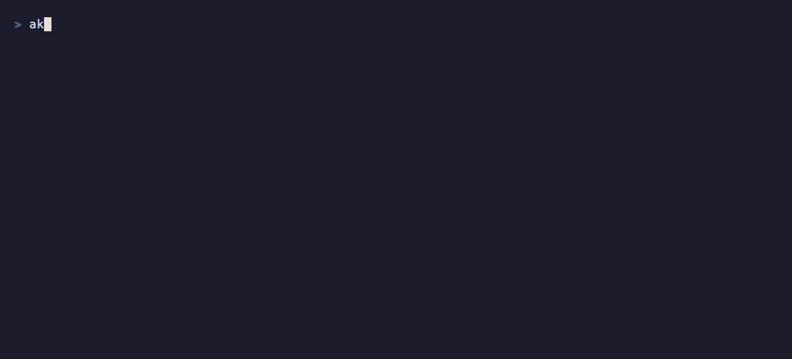

<div align="center">

# akuaku 🗿

### `top` for your AI agents.

Monitor every **Claude Code**, **codex**, and **ollama** run in one live dashboard — driving the CLIs you already log into. No API keys, no tokens, no hosted backend.



`go install github.com/akuaku-ai/akuaku/cmd/akuaku@latest` · try it now with `akuaku demo`

</div>

## Why

- **Use your existing logins.** Akuaku drives `claude`, `codex`, and `ollama` as subprocesses — it never talks to an API or handles your tokens.
- **One pane of glass.** See what every agent is doing, whether it succeeded, and what it cost.
- **Open by contract.** The state directory is the public interface: any process that writes a conforming JSON file shows up in the monitor. Nothing is closed.

## Install

```sh
go install github.com/akuaku-ai/akuaku/cmd/akuaku@latest
```

`go install` drops the binary in `$(go env GOPATH)/bin`, which is often not on your `PATH` — so the first run fixes that for you:

```sh
"$(go env GOPATH)/bin/akuaku" setup   # adds akuaku to your PATH, checks backends
```

Then restart your shell (or `source` your profile) and `akuaku` just works. To upgrade later, run `akuaku update` — no need to remember the install command.

Or build from source:

```sh
git clone https://github.com/akuaku-ai/akuaku
cd akuaku
make build   # produces bin/akuaku
```

Requires Go 1.24+. To launch agents you also need the `claude`, `codex`, and/or `ollama` CLIs installed and logged in — `akuaku setup` tells you which are missing.

## Usage

See it alive with no agents of your own — a simulated fleet, zero setup:

```sh
akuaku demo
```

It writes to a throwaway directory (your real runs are untouched) and cleans up when you quit with `q`.

Start the monitor:

```sh
akuaku
```

It opens a full-screen dashboard: an overview strip (live/done/error counts, total tokens and cost) over a full-width table of agents, with running agents on top and each row colored by status. Navigate with `↑`/`↓` (or `k`/`j`), press `Enter` to open a run and read the exchange as a conversation, `Esc` to go back, and `q` to quit.

By default the list shows the agents still in play — **running** and **waiting** (`◐`, blocked on you for a permission prompt or your next message); press `a` to toggle the full history (every status) and back. When an agent finishes, fails, or starts waiting for you, Akuaku rings the terminal bell and shows a banner, so you can leave it open in a split and get pulled back only when an agent needs you.

Press `/` to filter the list as you type — matching name or model. Prefix the query with `-n ` or `-m ` to match only the name or only the model (e.g. `-m opus`). `Enter` applies the filter, `Esc` clears it.

Press `:` for commands on the selected agent. `:rename <name>` gives it a custom label (stored as an overlay, so the run's own state is never touched). `:kill` stops a running agent by signaling its recorded process; it works for agents Akuaku launched and for discovered ones (both carry a PID), but not reflected hook sessions, which have no process to kill.

Press `k` for the same kill on the selected agent with a one-key confirmation (`y` to confirm, `n` to cancel) — quicker than typing `:kill`, and guarded so a stray keystroke never terminates a process.

By default the monitor is **scoped to the directory you launched it in**: it shows agents whose working directory is that folder or below it, so opening Akuaku inside a project shows that project's agents, not every session on the machine. `:global` widens the list to every directory; `:local` scopes it back. The active scope shows in the footer. Runs with no recorded directory (older runs) appear only in `:global`. Every producer records its directory — `akuaku run` and reflected hook sessions from their working directory, discovered processes from the OS.

**Process discovery is on by default.** Hooks and `akuaku run` only record sessions that start *after* you wire them up — anything already running when you open the monitor would otherwise be invisible. So Akuaku scans the process table each tick and surfaces every running agent CLI (`claude`, `codex`, `ollama run`) it finds, labeled by its working directory, deduped by PID against what's already on disk. Discovered runs show `—` for tokens and cost and carry no task: Akuaku reads only what the OS exposes (command, PID, directory, start time), never transcripts. They vanish on their own when the process exits. Type `:discovery` to toggle it off (and back on).

Launch an agent:

```sh
akuaku run claude "refactor the auth module"
akuaku run codex  "write tests for parser.go"
akuaku run ollama "summarize this design" --model llama3.1
```

The run prints the agent's answer when it finishes (and records it, so you can reopen it in the monitor with `Enter`).

Flags:

| Flag | Description |
| --- | --- |
| `-m`, `--model` | Model to use (required for `ollama`, optional otherwise) |
| `-n`, `--name` | Display name for the run |

Each run writes one JSON file to the state directory; the monitor reads them on a one-second tick.

Run `akuaku help` for the full command list and `akuaku version` to print the build version.

## Reflect sessions from other terminals

Not every Claude session starts with `akuaku run`. When you launch Claude Code directly — in another terminal, an IDE, wherever — Akuaku can still surface it in the monitor. One command wires it up:

```sh
akuaku hook install
```

This merges Akuaku's hooks into your `~/.claude/settings.json` (existing settings and hooks are preserved; re-running is a no-op). From then on, every Claude Code session appears in the monitor as it starts, updates with your first prompt, moves to `waiting` when it needs you (a permission prompt or a finished turn) and back to `running` when you reply, and flips to `done` when it ends:

```
NAME              BACKEND  STATUS   DUR   TOKENS     COST
refactor auth     claude   running  0:12    1200   $  0.04   ← akuaku run
review PR #42     claude   running  0:03       —        —    ← reflected via hook
```

Reflected runs show `—` for tokens and cost: Claude Code hooks don't expose usage, and Akuaku never reads transcripts. The mechanics are the same contract as everything else — `akuaku hook <event>` is the producer Claude Code calls, and it writes a `source: "hook"` run to the state directory.

## Backends

| Backend | Command | Tokens | Cost |
| --- | --- | --- | --- |
| `claude` | `claude -p … --output-format json` | ✅ | ✅ `total_cost_usd` |
| `codex` | `codex exec --json` | ✅ | — (not reported) |
| `ollama` | `ollama run <model> … --verbose` | ✅ | — (local) |

Token and cost parsing is best-effort: unrecognized output degrades to zero without failing the run.

## How it works

Akuaku is two decoupled halves joined by the filesystem:

- **`akuaku run`** spawns a backend subprocess and writes the run's lifecycle to `state/<id>.json` (`running` → `done`/`error`, with tokens, cost, and exit code). Writes are atomic (temp file + rename).
- **`akuaku`** (the monitor) only *reads* `state/*.json`. It never writes, and it derives every metric by scanning the directory.

Because the state JSON is the only channel, anything can be a producer — `akuaku run`, a Claude Code hook (see above), a script, a cron job, or a future integration — and it appears in the monitor with no code changes. Backends live behind a small interface, so adding one is a definition plus a parser.

## Configuration

| Variable | Default | Description |
| --- | --- | --- |
| `AKUAKU_STATE_DIR` | `~/.akuaku/state` | Directory where runs are read and written |

## Roadmap

- Reflect Codex and other agents started outside Akuaku (Claude Code sessions already work via `akuaku hook install`).
- An embedded, interactive Claude session inside the TUI.
- Alerts → webhooks → connectors.

## FAQ

**Does this use the Anthropic API or my tokens?**
No. Akuaku launches your already-authenticated CLI (`claude`, `codex`, `ollama`) as a subprocess — the exact same one you run by hand. No API keys, no extra billing. It reads only what the tools and the OS expose; it never touches your transcripts.

**Do I have to change how I run my agents?**
No. Keep launching Claude Code however you like — `akuaku hook install` surfaces those sessions, and discovery finds anything already running. `akuaku run` is there when you want Akuaku to launch one for you.

## Development

```sh
make check   # fmt, vet, lint, test
make cover   # test with coverage
```

The internal packages are held at **100% test coverage**. The project uses [OpenSpec](https://github.com/Fission-AI/OpenSpec) for spec-driven development; specs live under `openspec/`.

## License

[MIT](LICENSE)
